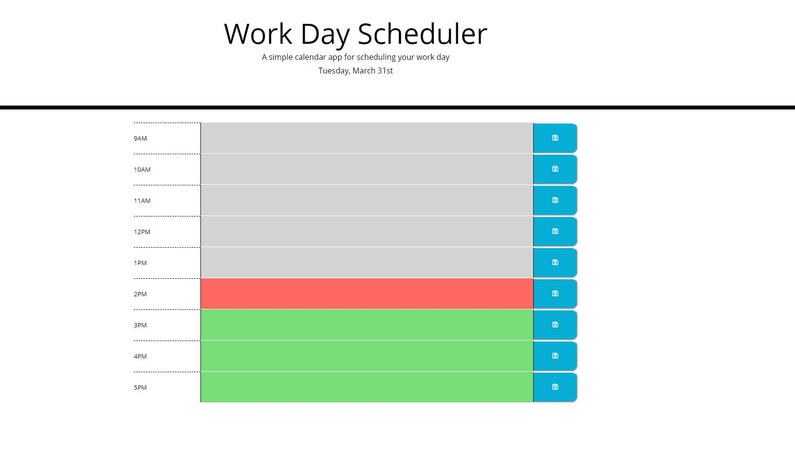

# Homework 05 Third-Party APIs: Work Day Scheduler

Christina Leung
https://cgleungsf.github.io/HW5_WorkDayScheduler/

## Description

In this app a user can manage their work day schedule by entering their events throughout their day within the respective hour intervals and click the save button represented by a floppy disk icon. 

## Technolgies

HTML
CSS
JavaScript
jQuery
Moment.js
Font Awesome

## Challenges

The most difficult portion of this assignment was adapting to jQuery and combining the necessary buttons to actions based on an index. 

## Screenshot

